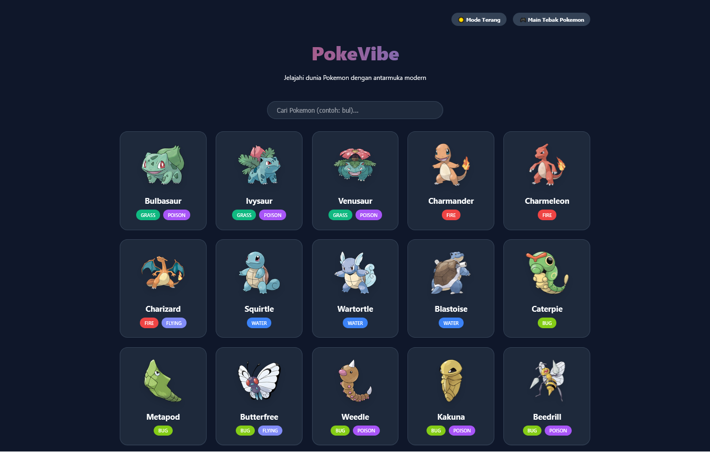

# PokeVibe - Modern Pokemon Search

A beautiful and responsive Pokemon explorer using the PokeAPI.

## Features
- **Pokemon Search**: Instant search for any Pokemon by name.
- **Detailed Stats**: View height, weight, and base stats in a modern modal.
- **Type-based Themes**: Cards and modals change color based on the Pokemon's primary type.
- **Infinite Scrolling**: Load more Pokemon with a single click.
- **Glassmorphism UI**: Clean and high-end design.

## Tech Stack
- **Frontend**: React + Vite
- **API**: PokeAPI (fetch)
- **Styling**: Vanilla CSS

## How to Run
1. Clone the repository.
2. Run `pnpm install`.
3. Run `pnpm dev`.

## Interactive Guess The Pokemon Game

### 🎮 Mini-Game
Interact with a beautiful guessing game interface featuring Pokemon silhouettes:

### 🎉 Reveal State
The reveal screen upon guessing the Pokemon correctly, showing its full design and stats:

